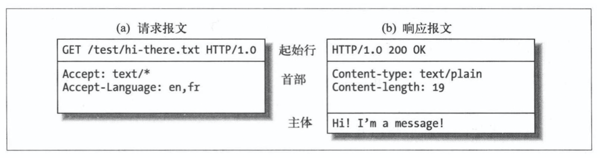
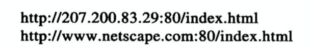

### HTTP相关概述 p1-p18 2021.12.30

包括：MIME、URI、HTTP方法、状态码及短语、请求响应报文、TCP/IP、协议版本

#### 媒体类型MIME

HTTP给每种要通过Web传输的对象打上名为MIME类型的数据格式标签，当web浏览器去服务端取数据对象时会查看MIME类型，看是否可以处理。MIME是一种文本标记，表示一种主要的对象类型和一个特定的字类型，如：text/html标记HTML文本。

#### URI

每个资源都有一个名字，客户端可以按照名字拿到资源，这个名字叫**统一资源标识符**，也就是URI。这个名字世界范围内唯一。URI有两种形式：URL和URN

- URL，统一资源定位符。描述特定服务器上某资源的特定位置。由协议，服务器地址，资源位置组成。
- URN，统一资源名。URN作为特定内容的唯一名称，与资源所在地无关。可以将资源进行搬移。URN目前还在实验阶段。

#### HTTP方法

一个HTTP事务由一条请求和一个响应组成。每个HTTP请求都有个方法，HTTP方法告诉服务器要执行什么动作。常用HTTP方法：

- GET 服务器向客户端发送命名资源
- PUT 将客户端数据存到一个命名的服务器资源中去
- DELETE 从服务器中删除命名资源
- POST 将客户端数据发送到一个服务器网关应用程序
- HEAD 仅获取响应的首部

#### 状态码，短语

每条响应报文返回时会携带一个状态码，还会有一个解释性的短语。告知客户端是否成功以及情况描述。比如： 200 OK

#### 报文

报文由一行行简单的字符串组成。如下图

HTTP报文主要由三部分组成：

- 起始行 请求报文起始行说明要做什么，响应报文起始行说明出现了什么情况
- 首部字段 键值对的形式
- 主体 请求主体是客户端要发给服务器的数据，响应主体则是服务器返回的数据

请求报文和响应报文的起始行不一样，请求报文由HTTP方法，资源地址，协议版本组成；响应报文的起始行由协议版本，状态码，说明短语组成。

#### TCP/IP

HTTP是应用层协议，不关心网络连接的问题，联网的事交给TCP/IP，TCP提供了：

- 无差错数据传输
- 按顺序传输
- 未分段的数据流，任意尺寸发送

HTTP协议(应用层)位于TCP(传输层)的上层，而TCP则位于IP(网络层)的上层。五层：

- 应用层 HTTP
- 传输层 TCP
- 网络层 IP
- 数据链路层 网络特有的链路接口
- 物理层 物理网络硬件

#### 连接,IP,端口号

TCP需要知道服务器的IP地址，以及在服务器上运行的特定软件相关的TCP端口号，这两项从URL获取

第一个URL使用了数字形式的IP地址，第二个URL使用了文本形式的域名，也就是主机名。主机名和IP地址之间的转化由DNS负责。

#### 协议版本

- HTTP 0.9
  只支持GET方法，不支持多媒体内容的MIME类型、各种首部、版本号
- HTTP 1.0
  添加了版本号、首部、MIME、一些HTTP方法。同一时间同一域名连接数量有限，超过数量会阻塞，并且一次传输一次连接，无状态
- HTTP 1.1
  默认持久连接，不需要声明keep-alive，一个连接可多个请求按顺序执行，如果某个请求时间长会队头阻塞
- HTTP 2.0
  二进制分帧、首部压缩、多路复用、请求优先级、服务器推送

#### Web的结构组件

- 代理 位于客户端和服务器之间的HTTP中间实体，接收客户端的请求并转发给服务器，可以对请求进行修改也可以对响应进行过滤
- 缓存 HTTP的仓库，保存常用页面的副本，是一种特殊的HTTP代理服务器
- 网关 连接其他应用程序的特殊Web服务器，通常用于将HTTP流量转换成其他协议。客户端可能不知道自己在与一个网关进行通信
  
  
- 隧道 对HTTP通信报文进行盲转发的特殊代理
- agent代理 发起自动HTTP请求的半智能web客户端，是代表用户发起HTTP请求的客户端程序。所有发布Web请求的应用程序都是HTTP Agent代理
