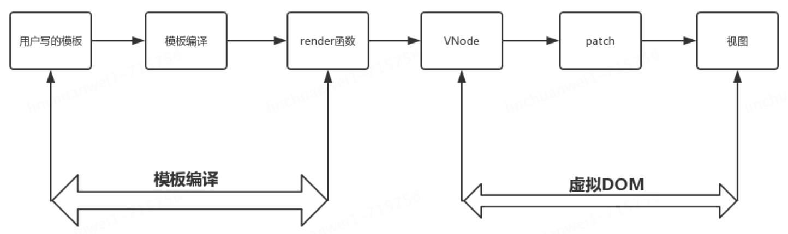
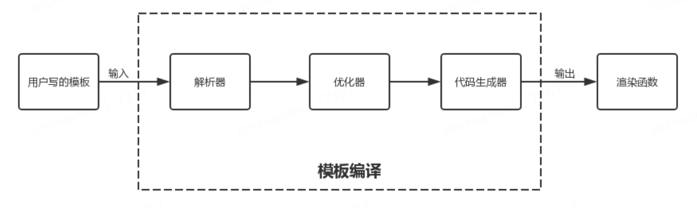

## 模板编译

虚拟 `DOM`的存在首先是要有 `VNode`，而 `VNode`从哪来？将用户写的模板进行编译就会产生 `VNode`

> **什么是模板编译？**
>
> 写在 `<template></template>`标签中的原生HTML和非原生部分(V指令等东西)，经过一系列处理生成渲染函数 `rander`，`rander`函数将模板中的内容生成对应的 `VNode`

模板编译内部是怎么把用户写的模板经过处理最终生成 `rander`函数的，具体流程大致分三个阶段：

1. 模板解析阶段：将一堆模板字符串用正则等方式解析，包括指令、class、style等数据，形成 `AST`
2. 优化阶段：遍历 `AST`，找出其中的静态节点，并打上标记，对比虚拟 `DOM`的时候跳过静态节点提高效率
3. 代码生成阶段：将 `AST`转换成渲染函数

这三个部分分别对应源码中的解析器、优化器、代码生成器

### 模板解析

在模板解析阶段主要做的工作是把用户在 `<template></template>`标签内写的模板使用正则等方式解析成抽象语法树（`AST`）。而这一阶段在源码中对应解析器（`parser`）模块。

模板中不止包含常规的HTML，还包括文本，文本中包含的过滤器

> **模板解析的流程就是？**
>
> HTML解析器是主线，遇到文本就调用 文本解析器解析文本，遇到文本中包含过滤器就调用过滤器解析器解析

具体的详细解析流程不多了解了
